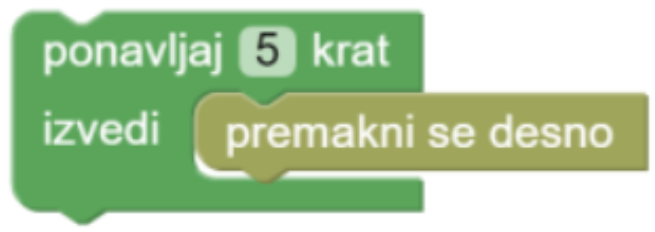

Če napišemo novo pop-uspešnico, v kateri brez predaha uporabljamo iste štiri akorde `C G a F`
in želimo to deliti s svojim kolegom, bo kar trajalo, da natipkamo celo pesem

`C G a F C G a F C G a F C G a F C G a F C G a F C G a F C G a F ... C G a F`

zato se znajdemo, prepoznamo vzorec, ki se ponavlja, in kolegu pošljemo

```
ponovi 50-krat:
    C G a F
```

Podobno je pri programiranju. Namesto da napišemo

```
pojdi v desno
pojdi v desno
pojdi v desno
pojdi v desno
pojdi v desno
```

poznajo tudi programski jeziki bližnjice, ki jim pravimo zanke. Na portalu Pišček so videti tako:



Tu v zanki povemo, kolikokrat je treba ponoviti njeno vsebino. Kasneje bomo spoznali še drugi tip zank, ki jih uporabimo,
ko število ponovitev ni poznano v naprej, moramo pa ponavljati določene ukaze, dokler je izpolnjen neki pogoj,
npr.

```
dokler ne padeš čez rob sveta:
    pojdi v desno
```
Vendar bomo te zanke spoznali kasneje, saj bomo najprej spoznali pogojne stavke.

## Brez računalnika

### Barvanje mreže

Katere od mrež (iz zaporedja ukazov) lahko pobarvamo tako, da ponavljamo kratko zaporedje ukazov?

## Naloge na Portalu Pišek

### [Slastna zrna](https://pisek.acm.si/contents/4907-905475276192595697-1358046987851793899-731188588614266740/)

Sprehodite se do zrna, a poskusite porabiti čim manj koščkov.

Ko rešiš nalogo za ⭐⭐, poskusi rešiti še nalogi za ⭐⭐⭐ in ⭐⭐⭐⭐.

### [Ovinek](https://pisek.acm.si/contents/4907-905475276192595697-1358046987851793899-189892486372422998/)

Sprogramiraj robotka, da pride do cilja.
Pozor - število delčkov je tu omejeno, zato se je načrtovanja programa treba lotiti pametno.

Ko rešiš nalogo za ⭐⭐, poskusi rešiti še nalogi za ⭐⭐⭐ in ⭐⭐⭐⭐.

### [Seprentina](https://pisek.acm.si/contents/4907-905475276192595697-1358046987851793899-678880300412440287/)

Pomagaj robotu priti do konca poti.

Ker je na voljo le malo delčkov, je zelo pomembno, da program sestavimo pametno. Razmisli, kakšen je vzorec, ki se ponovi.

Ko rešiš nalogo za ⭐⭐, poskusi rešiti še nalogi za ⭐⭐⭐ in ⭐⭐⭐⭐. Ne pozabi,
da lahko zanke **gnezdimo** - znotraj ene zanke lahko vstavimo drugo zanko.

### [Zmajček in cekini](https://pisek.acm.si/contents/4907-319805995281415931-895474193433606586-1672915584168735419-43613985217736079/)

Sprehodi zmajčka tako, da bo pobral vse cekine. Opaziš kakšne ponavljajoče se vzorce? Ali lahko cekine pobiraš tudi na drugačen način?

Ko rešiš nalogo za ⭐⭐, poskusi rešiti še nalogi za ⭐⭐⭐ in ⭐⭐⭐⭐. Ne pozabi,
da lahko zanke **gnezdimo** - znotraj ene zanke lahko vstavimo drugo zanko.

### Dodatne naloge

- [Pišek dirka](https://pisek.acm.si/contents/4907-905475276192595697-1358046987851793899-1874530050108823978/)
- [Pišek se igra](https://pisek.acm.si/contents/4907-905475276192595697-1358046987851793899-111234299455299402/)
- [Napačni koraki](https://pisek.acm.si/contents/4907-905475276192595697-1358046987851793899-1831466676732218831/)

### Dodatna naloga za zagrete

- [Reševanje snežaka](https://pisek.acm.si/contents/4907-905475276192595697-1358046987851793899-139296978042706121/)
