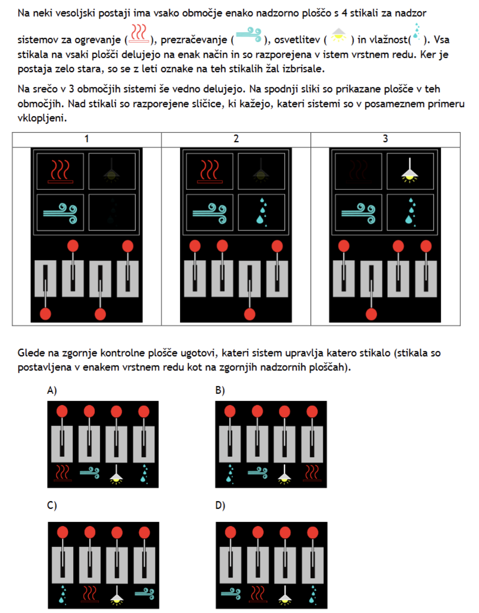
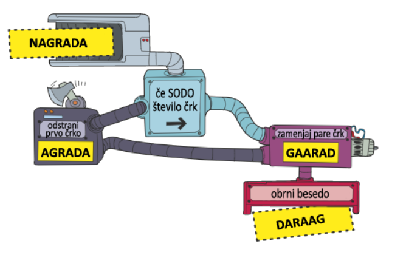
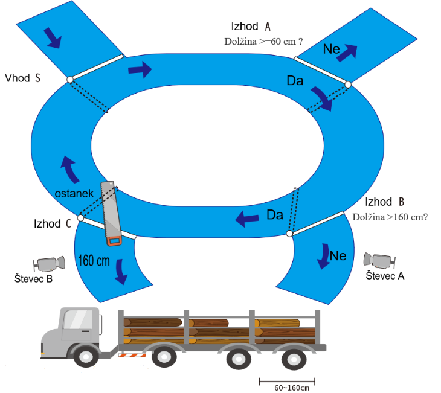
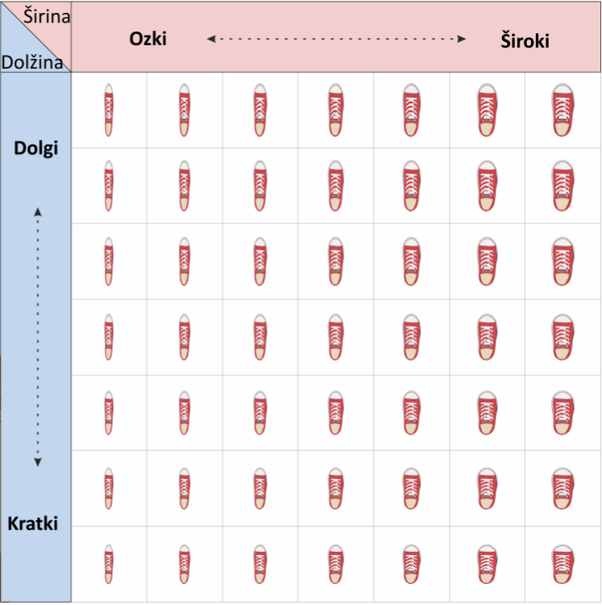
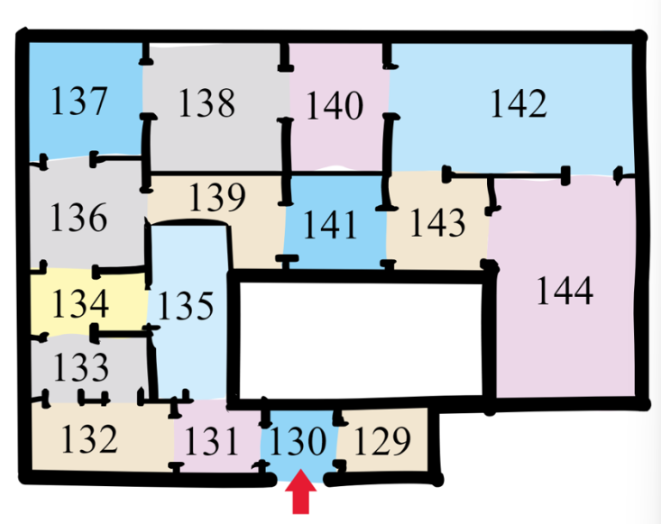
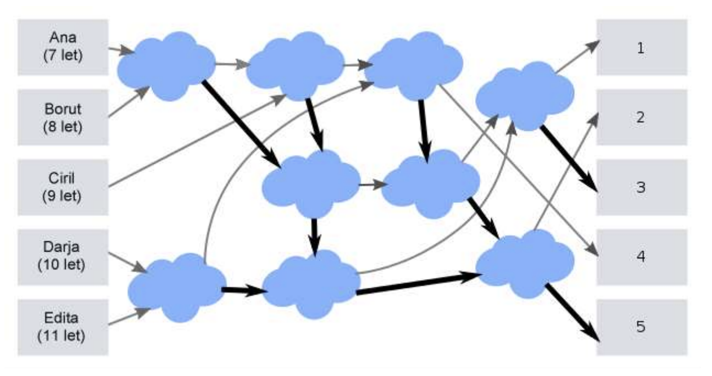
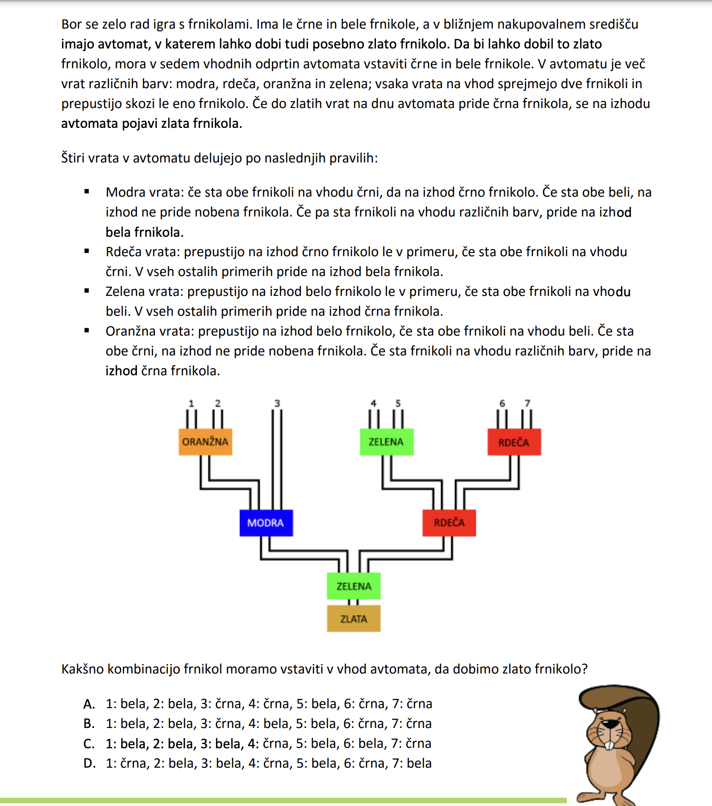
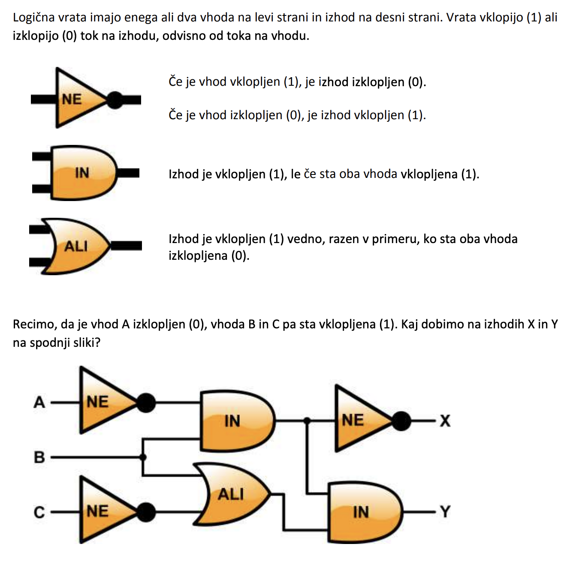
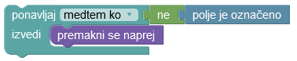
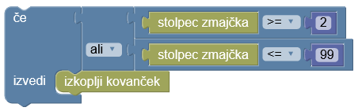

<script type="text/javascript" async
  src="https://cdnjs.cloudflare.com/ajax/libs/mathjax/2.7.7/MathJax.js?config=TeX-MML-AM_CHTML">
</script>

Kako bi rešili nalogo, pri kateri stoji Pišek v isti vrstici kot zrno, ampak ne vemo, kako daleč?

```
P _ _ _ … _ Z
```

Če bi vedeli kako daleč se nahaja, bi lahko uporabili zanko, kakršno smo spoznali zadnjič. Ker pa se premikamo neznano daleč stran, moramo korakati desno _dokler ne_ pridemo do zrna

```
dokler ni zrna:
    premakni se desno
```

V tej zanki smo uporabili pogoj. In izvajali kodo znotraj njega, dokler pogoj ni bil resničen.

Včasih pa se želimo na neki točki odločiti med dvema ali več možnimi izvedbami, pri čemer nam pomaga _vejitev_ oziroma pogojni _stavek_.

Pogojni stavki so ukazi posebne vrste, ki jih uporabimo takrat, kadar želimo nek ukaz izvesti samo v primeru, ko je izpolnjen nek pogoj. Se spomnite kakega primera?

- _Če bo zvečer napovedan dež, bom doma igrala kitaro._
- _Če se bo med vožnjo oglasil mehur, se bomo ustavili na postajališču._

Pogojne stavke uporabimo tudi v primeru, ko je naš naslednji korak odvisen od nekega pogoja.

- _Če bo zvečer napovedan dež, bom doma igrala kitaro. Sicer grem pogledat Kino pod zvezdami._
- _Če želimo po avtocesti, moramo levo. Sicer moramo desno._

Pogoji so lahko preprosti (npr. _zvečer napovedan dež_, _želimo po avtocesti_) ali pa sestavljeni iz več delov:

- _Če bo zvečer napovedan dež ali bom preutrujena, bom šla kar spat._
- _Če bo Dimec pri metu in se Dončić ne bo prepiral s sodniki, imamo možnosti za zmago._

Preproste pogoje sestavljamo v bolj kompleksne s pomočjo raznih logičnih operatorjev.

## Logični operatorji

Pogoj je lahko resničen ali neresničen. Resničnim pogojem v programiranju po navadi pripišemo vrednost `true` oz. 1, neresničnim pa `false` oz. 0. Ker je 0 in 1 precej lažje natipkati, bomo v teh zapiskih uporabljali ti vrednosti.

Spodaj spoznamo nekaj osnovnih logičnih operatorjev.

### Negacija

Najpreprostejši logični operator je negacija, ki ga v matematiki označimo z $$\neg$$, v programskih jezikih pa večinoma z `not`, `!` ali `~`. Resničnostna tabela
za negacijo je

| `P` | `not P` |
| --- | ------- |
| 0   | 1       |
| 1   | 0       |

Torej: če `P` drži, potem `not P` ne drži in obratno.

### In

Logični operator in (v matematiki označen z $$\land$$, v programiranju pa večinoma z `and` oz. `&&`) sprejme pogoja `P` in `Q` ter vrne vrednost 0 oz. 1 v skladu s spodnjo resničnostno tabelo:

| `P` | `Q` | `P and Q` |
| --- | --- | --------- |
| 0   | 0   | 0         |
| 0   | 1   | 0         |
| 1   | 0   | 0         |
| 1   | 1   | 1         |

Pogoj `P and Q` torej velja le v primeru, ko veljata tako `P` kot `Q`.

### Ali

Logični operator ali (v matematiki označen z $$\lor$$, v programiranju pa večinoma z `or` oz. `||`) ima naslednjo resničnostno tabelo:

| `P` | `Q` | `P or Q` |
| --- | --- | -------- |
| 0   | 0   | 0        |
| 0   | 1   | 1        |
| 1   | 0   | 1        |
| 1   | 1   | 1        |

Pogoj `P or Q` velja torej takrat, ko je izpolnjen vsaj eden od pogojev `P` in `Q`.

### Preostali logični operatorji

Poleg operatorjev `not`, `in` ter `ali` ste v srednji šoli najbrž že spoznali implikacijo $$P \Rightarrow Q$$ z resničnostno tabelo

| `P` | `Q` | `P => Q` |
| --- | --- | -------- |
| 0   | 0   | 1        |
| 0   | 1   | 1        |
| 1   | 0   | 0        |
| 1   | 1   | 1        |

ter ekvivalenco $$P\Leftrightarrow Q$$ z resničnostno tabelo

| `P` | `Q` | `P <=> Q` |
| --- | --- | --------- |
| 0   | 0   | 1         |
| 0   | 1   | 0         |
| 1   | 0   | 0         |
| 1   | 1   | 1         |

Izkaže se, da programski jeziki teh dveh logičnih operatorjev (kot tudi bolj eksotičnih) ne poznajo in jih je treba izraziti z `not`, `and` ter `or`.
Tako moramo namesto $$P\Rightarrow Q$$ npr. pisati `(not P) or Q`.

## Brez računalnika

#### Od formule do tabele

Najdi resničnostno tabelo za spodnje formule:

- `P and Q and R`,
- `(P and Q) or ((not P) and (not Q))`,
- `not (P and Q)`,
- `(not P) or (not Q)`.

#### Od tabele do formule

Najdi formulo, ki pripada resničnostni tabeli operatorja `?`:

| `P` | `Q` | `P ? Q` |
| --- | --- | ------- |
| 0   | 0   | 1       |
| 0   | 1   | 0       |
| 1   | 0   | 1       |
| 1   | 1   | 1       |

#### Koliko jih je?

Koliko je dvomestnih logičnih operatorjev (`ali` ter `in` sta dva od njih)?

#### Vse muhe na en mah

S pomočjo logičnega operatorja `#` (njegovo resničnostno tabelo lahko vidite spodaj), izrazi operatorje `not`, `and` in `or`.

| `P` | `Q` | `P # Q` |
| --- | --- | ------- |
| 0   | 0   | 1       |
| 0   | 1   | 0       |
| 1   | 0   | 0       |
| 1   | 1   | 0       |

Kako bi operator `#` izrazil s pomočjo `and`, `or`, `not`?

### Elektronska vezja

Naredi vezje z dvema stikaloma in lučjo, tako da velja:

- Luč je prižgana, če sta vključeni obe stikali (koristno, ko želimo dodatno varnost).
- Luč je prižgana, če je vključeno vsaj eno od stikal (koristno, ko prožimo alarme).
- Stanje luči se spremeni ob vsakem pritisku na katerokoli stikalo (koristno, ko imamo dolg hodnik z vrati na začetku in na koncu ter stikalo ob vsakih vratih).

Kateremu logičnemu operatorju ustreza vsak od zgornjih primerov?

### Collatz

Collatzovo zaporedje je zapordeje, ki ga dobimo na sledeč način. Začnemo z nekim številom $$n$$, potem pa glede na parnost tega števila izbiramo med dvema operacijama:

- če je število $$n$$ sodo, ga delimo z 2,
- če je število $$n$$ liho, ga pomnožimo s 3 in prištejemo 1.

Zaporedje se konča, ko pridemo do števila 1, saj se v tem primeru začne ponavljati vzorec $$1 \rightarrow 4 \rightarrow 2 \rightarrow 1 \rightarrow \dots$$.

Za domačo nalogo, lahko dokažete, da se Collatzovo zaporedje za vsak začetni člen zagotovo konča (torej, pride do 1). Če vam to uspe, dokaz prinesite pokazati enemu od avtorjev teh zapiskov.

Vaša naloga tukaj pa je, da simulirate računalnik, ki računa Collatzovo zaporedje. Za to potrebujemo 3 prostovoljce. En zna za vsako liho število $$n$$ izračunati $$3n + 1$$, drugi zna za vsako sodo število $$n$$ izračunati $$n / 2$$, tretji pa zna za vsako število $$n$$ ugotoviti, ali je število sodo ali liho. Izračunajte zaporedje števila 52.

### Ugani število

Poskusite uganiti število med 0 in 100, ki si jo je izmislil izvajalec. Poskusite ugotoviti v čim manj poskusih. Največ koliko poskusov potrebujete, da zagotovo lahko uganete število?

### Najdi približno ničlo

Radi bi našli ničlo funkcije $$f$$ s predpisom $$f(x) = x^5 + 3 x^2 + x + 1$$.
Žal enačbe $$x^5 + 3 x^2 + x + 1 = 0$$ ne moremo rešiti po formuli, tako kot rešimo kvadratne enačbe,
zato bomo našli samo približen rezultat. Opazimo, da je $$ f(-2) = -21 < 0 $$ in $$ f(-1) = 2 > 0 $$, torej se ničla skriva nekje na intervalu $$(-2, -1)$$. Zapiši algoritem, ki izračuna njen približek,
ki se od prave ničle ne razlikuje za več kot $$0{,}1$$.

## Naloge iz Bobra

### Stikala



### Kodiranje besed

Bobri so sestavili stroj, ki kodira besede na naslednji način. Če ima beseda, ki jo podamo stroju, sodo število črk, jo pošlje naprej nespemenjeno, sicer pa odstrani prvo črko besede. Nato zamenja vse pare črk (med seboj zamenja prvo in drugo črko, nato tretjo in četrto črko in tako naprej). Na koncu pa stroj besedo še obrne.

Stroj tako besedo NAGRADA zakodira v DARAAG.
Potek delovanja stroja je prikazan na spodnji sliki:



Kaj dobimo, če stroju podamo besedo BOBRČEK?

### Žaga

Za izgradnjo brunarice potrebujemo hlode pravih dolžin, za kar poskrbi tovarna.
Do tovarne pridejo hlodi različnih dolžin, tam jih razžagajo in na tovornjak
zložijo hlode dolžin med 60 cm in 160 cm. Tovarna ima krožno obliko. Hlodi se premikajo po tekočem traku, ki ima 1 vhod in 3 izhode.

- Vhod S: tu lahko na trak pridejo novi hlodi.
- Izhod A: vsi hlodi, ki so krajši od 60 cm se tu izločijo in gredo na odpad.
- Izhod B: vsi hlodi, ki so dolgi največ 160 cm, se tu izločijo in gredo na tovornjak. Zazna in šteje jih števec A.
- Izhod C: na tem koraku najprej uporabimo žago, ki hlod razžaga na dva dela. Enega dolžine 160 cm, ki ga pošlje na tovornjak, drugega pa pošlje naprej po traku. Hlode, ki jih pošlje na tovornjak, zazna in šteje števec B.



Na trak zaporedno pošiljamo hlode dolžin 60 cm, 140 cm in 360 cm. Koliko bosta na koncu kazala števca A in B?

### Pomerjanje čevljev

Bober v trgovini pomerja čevlje. Na
voljo ima različne velikosti čevljev, kot
kaže slika. Čevlji so razporejeni
naraščajoče po širini in naraščajoče po
dolžini, pri čemer so najkrajši in najožji
čevlji levo na spodnji polici, najširši in
najdaljši pa desno na zgornji polici. Vsi
čevlji so različno dolgi
in široki.
Bober ve, da mu je
eden od čevljev prav. Ker
je pozabljiv, pa si ni
zapomnil njegove
številke, to je prave
širine in dolžine čevlja,
zato se bo moral lotiti
pomerjanja.
Bober želi najti način, s katerim bo zagotovo kupil čevlje, ki so mu prav, s kar se da malo
pomerjanji. Čevlje bo pomerjal po takšnem postopku, da jih bo moral poskusiti čim manj, a pri tem
vseeno zagotovo izvedel, kateri so mu prav. Koliko jih bo moral poskusiti v najslabšem primeru?



### Ogled muzeja

Slika kaže načrt dela muzeja Ermitaž v Sankt Peterburgu.



Viktorija je v muzej vstopila pri vratih, označenih z rdečo puščico. Želi si ogledati vse sobe tega dela muzeja, pri ogledu pa se bo ravnala po naslednjih pravilih:

- Ko pride v sobo, najprej pregleda, če je poleg nje kakšna soba, ki je še ni obiskala.
  - Če taka soba obstaja, bo obiskala neobiskano sosednjo sobo z najmanjšo številko.
  - Če take sobe ni, si ogleda eksponate v trenutni sobi.
- Ko zaključi z ogledom eksponatov v sobi, se vrne v sobo, iz katere je prvič vstopila v trenutno sobo.

Katera bo peta soba po vrsi, v kateri si bo Viktorija ogledala eksponate?

### Sprehod po oblakih

Pet bobrov, Ana (7 let), Borut (8 let), Ciril (9 let), Darja (10 let) in Edita (11 let), se igra igro, v kateri
se sprehajajo po oblakih. Na vsakem oblaku počakajo, da nanj prispe tudi drugi bober, nato pa
starejši bober nadaljuje pot do naslednjega oblaka po debeli puščici, medtem ko mlajši bober sledi
tanki puščici.



Na katere izhode bodo prišli bobri na koncu igre?

<ol type="A">
  <li>
    <ol>
      <li>Ana</li>
      <li>Borut</li>
      <li>Ciril</li>
      <li>Darja</li>
      <li>Edita</li>
    </ol>
  </li>
  <li>
  <ol>
      <li>Edita</li>
      <li>Darja</li>
      <li>Ciril</li>
      <li>Borut</li>
      <li>Ana</li>
    </ol>
  </li>
  <li><ol>
      <li>Borut</li>
      <li>Darja</li>
      <li>Ciril</li>
      <li>Ana</li>
      <li>Edita</li>
    </ol></li>
  <li><ol>
      <li>Borut</li>
      <li>Ciril</li>
      <li>Darja</li>
      <li>Ana</li>
      <li>Edita</li>
    </ol></li>
</ol>

### Frnikole



### Vezje



## Naloge na Portalu Pišek

### Operatorji na Portalu Pišček

Srečali boste logične operatorje `ne`, `in` ter `ali`, poleg tega pa še operatorje
`==`, `!=`, `<=`, `<`, `>=` in `>`:

- `x == y` vrne 1 natanko tedaj, ko sta `x` in `y` enaka (npr. `3 == 3`),
- `x != y` vrne 1 natanko tedaj, ko sta `x` in `y` različna (npr. `3 != 4`),
- `x <= y` vrne 1 natanko tedaj, ko je `x` manjši ali enak `y` (npr. `3 <= 3` in `3 <= 4`) ,
- `x < y` vrne 1 natanko tedaj, ko je `x` manjši od `y` (npr. `3 < 4`, ampak `3 < 3` ne velja),
- `x >= y` vrne 1 natanko tedaj, ko je `x` večji ali enak `y` (npr. `4 >= 3`),
- `x > y` vrne 1 natanko tedaj, ko je `x` večji od `y` (npr. `5 > 3`).

### [Orientacijski pohod](https://pisek.acm.si/contents/4907-905475276192595697-124593487069807966-1575202735895118993/)

Sprehajalec se sprehaja proti desni, če pa je polje označeno, mora narediti še korak navzgor.

Če ti je naloga zelo všeč, lahko rešiš še [Lov na zastavo](https://pisek.acm.si/contents/4907-905475276192595697-124593487069807966-1430889895220564935/) in [Tropsko preizkušnjo](https://pisek.acm.si/contents/4907-905475276192595697-124593487069807966-1999646710564579332/).

### [Pišek raziskuje](https://pisek.acm.si/contents/4907-905475276192595697-124593487069807966-1415830099417829505/)

Sprehodite Piška, tako da bo po poti pobiral semena (semen ni treba pobrati z ukazom, dovolj je, da obiščete polje). Če Pišek pride na _označeno polje_ (na njem so narisane stopinje), se obrne desno.

Ker ne veste, koliko časa bo treba hoditi do označenega polja, boste v zanki namesto neke konkretne vrednosti (npr. `5` korakov) uporabili pogoj, do kdaj naj se zanka izvaja. Zanki


oz.



imata isti učinek: pišček hodi naprej, dokler ne pride na označeno polje.

**Dodaten namig:** preštejte, koliko označenih polj je v obeh testnih primerih, tj. kolikokrat moramo izvesti eno od zgornjih zank. Ali smo pobrali vsa zrna, ko pridemo do zadnjega označenega polja?

Če ti je naloga zelo všeč, lahko rešiš še nalogi [Razdejanje](https://pisek.acm.si/contents/4907-905475276192595697-124593487069807966-1795987419785635156/) in [Labirinti](https://pisek.acm.si/contents/4907-905475276192595697-124593487069807966-410019299650043728/) (ki je malo težja).

### [Pišek v šoli](https://pisek.acm.si/contents/4907-905475276192595697-124593487069807966-742654630424273868/)

Na prvi stopnji je treba pobrati zrno, nato pa hoditi proti desni, dokler nismo nad gnezdom, kamor bomo pospravili zrno. Ker ne vemo, koliko časa bo treba hoditi, bomo v zanki namesto neke konkretne vrednosti (npr. `5`) uporabili pogoj (dokler nismo nad gnezdom).

Na drugi stopnji je semen in gnezd več, a so lepo urejena v dva stolpca, na tretji stopnji pa so bolj razmetana.

### [Zmajček barva](https://pisek.acm.si/contents/4907-905475276192595697-124593487069807966-11091611319993327/)

Pri tej nalogi moramo pobarvati označena polja, a se pri tem ne moremo zanašati na pogoj `je označeno`, kot pri nekaterih drugih nalogah. Namesto tega imamo dostop do trenutnega položaja:
košček `stolpec zmajčka` in - na višjih stopnjah - `vrstica zmajčka`. S pomočjo teh kosov lahko tvorimo kompleksnejše pogoje, npr.



Na prvi stopnji so označena polja v stolpcih 7, 8, 9, 10 in 11, na drugi in tretji stopnji pa
so zložena v trikotnik (ki ga malo manjka) in križ.

**Opomba:** Če koščka `pobarvaj polje` ni, lahko uporabite `izkoplji kovanček`.
