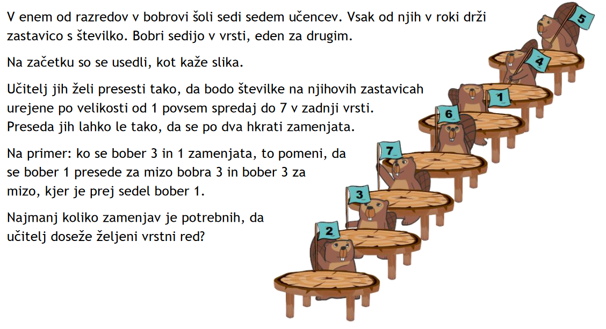
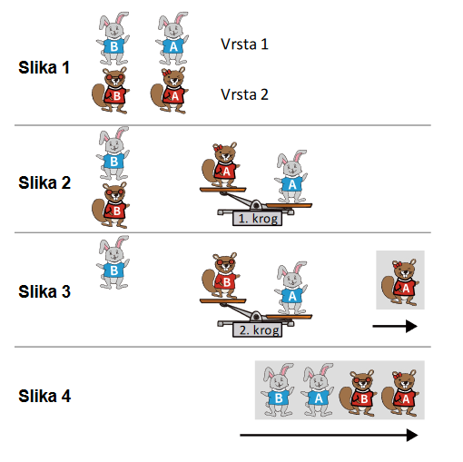
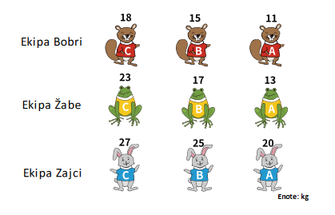

Vam pride na misel kak primer, ko potrebujemo urejanje?

Urejanje je zgodovinsko zelo pomemben problem in je bil eden prvih, ki so jih ljudje reševali.

Seveda je očitno, kaj pomeni, da uredimo nek seznam števil, ampak ali znamo natančno definirati, kaj pomeni, da uredimo seznam?

Definirati je treba kaj je vhodni podatek, kaj je izhodni in če je med njima kakšna povezava.

1. Izhodni seznam je urejen, če velja `a[i] < a[i+1]` za vsak i.
2. Izhodni seznam je permutacija vhodnega. Kaj to pomeni: elementi so enaki, samo razporejeni so lahko drugače.

Pomembno,prazen seznam in seznami s samo enim elementom so urejeni.
To je seveda očitno, a nam bo prišlo močno prav.

Poskusi se spomniti algoritma, ki uredi seznam števil. Ugotovi koliko "časa" vzame urejanje seznama na tak način.

Naštejmo nekaj možnosti kako urediti seznam števil:

- Seznam uredimo tako, da zaporedoma poiščemo najmanjši element in ga postavimo v "vrsto".
- Seznam uredimo tako, da iz prvotnega seznama zaporedno vzemamo števila in jih postavimo na pravo mesto.
- Seznam uredimo tako, da primerjamo po dva zaporedna elementa in ju po potrebi zamenjamo. To ponavljamo, dokler seznam ni urejen.

Za vsakega od zgornjih načinov poskusi ugotoviti koliko "časa" vsame v številu primerjav. Se morda lahko spomniš bolj učinkovitega algoritma?

## Brez računalnika

### Uredi embalažo po teži

Na voljo imamo nekaj posod za kavo, ki so različno napolnjene, ter primerjalno tehtnico.

Uredite posode za kavo od najlažje do najtežje.

### Urejanje števil

V skupini uredite 100 števil na papirčkih.

Kako bi zapisali najdene algoritme z zaporedji ukazov?

## Naloge iz Bobra

### Presedanje učencev

Koliko korakov bi potrebovali z različnimi algoritmi za urejanje, o katerih smo se pogovarjali.

### Razvrstitev

Danes je tekmovanje v suvanju krogle, na katerem sodeluje več živalskih ekip. Organizatorji želijo pred začetkom tekmovanja vse tekmovalce (ne glede na ekipo) razvrstiti od najlažjega do najtežjega. Najprej se tekmovalci vsake ekipe razvrstijo v vrsto od najlažjih na desni do najtežjih na levi. Potem se po dve vrsti hkrati združita v eno in to ponavljajo, dokler niso združene vse vrste. Pri združevanju dveh vrst upoštevajo naslednje korake:

1. Prvi tekmovalec v vsaki izmed dveh vrst, ki ju združujejo, se postavi na vsako stran tehtnice.
2. Lažji tekmovalec se postavi na konec združene vrste. Težji tekmovalec ostane na tehtnici, na kateri se mu pridruži naslednji tekmovalec iz vrste, v kateri je bil lažji tekmovalec. Ta korak ponavljajo, dokler ni ena izmed vrst prazna.
3. Preostali tekmovalci iz druge vrste se urejeni po teži priključijo na konec združene vrste. Spodnja slika prikazuje, kako se združita dve vrsti:

Za združitev teh dveh vrst sta bili potrebni dve primerjavi (dve tehtanji). Na tekmovanje so se prijavile 3 ekipe, v katerih so po 3 tekmovalci. Številka nad tekmovalcem pove, kakšna je njegova teža v kilogramih. Za združevanje katerih dveh vrst bo potrebnih največ primerjav?

<ol type="A">
  <li>Ekipe Bobri in ekipe Žabe.</li>
  <li>Ekipe Žabe in ekipe Zajci.</li>
  <li>Ekipe Zajci in ekipe Bobri.</li>
  <li>Za združevanje katerihkoli dveh ekip potrebujemo enako število primerjav.</li>
</ol>

## Urejanje brez primerjav

Včasih imajo predmeti, ki jih urejamo, posebaj lepe lastnosti in jih lahko uredimo celo hitreje kot z zlivanjem.

Na primer kadar skupino učencev urejamo po abecedi, lahko najprej vse učence razdelimo v skupine po prvi črki priimka, nato pa znotraj vsake od teh skupin po drugi črki priimka in tako naprej. Pri tem učencev med seboj ni treba primerjati, saj vemo, kako si črke sledijo po abecedi. Takemu urejanju pravimo "Bucket sort", saj predmete urejanja razvrščamo v "vedra".

Še en primer urejanja je urejanje s štetjem. Števila lahko uredimo tudi tako, v seznamu preštejemo, kolikokrat se nam pojavi posamezno število, nato pa se sprehodimo čez števec in v seznam zaporedno vstavljamo ustrezno število števil.

Urejanje si lahko vizualno pogledaš tudi na [povezavi](https://visualgo.net/en/sorting).
