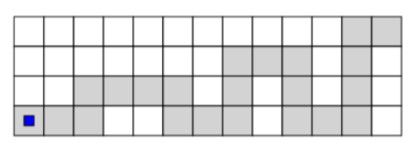
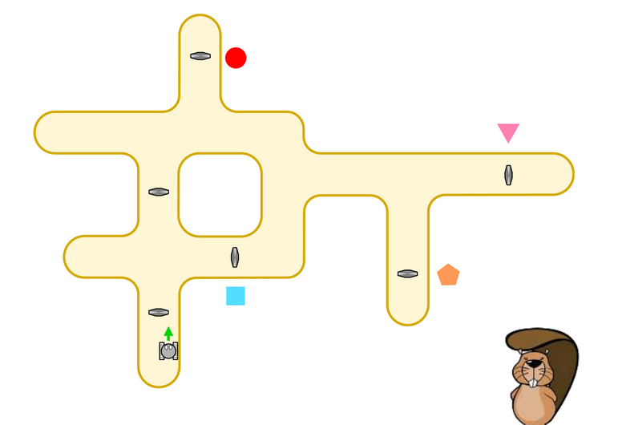
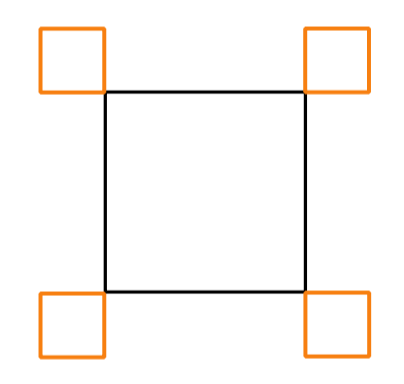

<script type="text/javascript" async
  src="https://cdnjs.cloudflare.com/ajax/libs/mathjax/2.7.7/MathJax.js?config=TeX-MML-AM_CHTML">
</script>

# Zanke

Če napišemo novo pop-uspešnico, v kateri brez predaha uporabljamo iste štiri akorde `C G a F`
in želimo to deliti s svojim kolegom, bo kar trajalo, da natipkamo celo pesem

`C G a F C G a F C G a F C G a F C G a F C G a F C G a F C G a F ... C G a F`

zato se znajdemo, prepoznamo vzorec, ki se ponavlja, in kolegu pošljemo

```
ponovi 50-krat:
    C G a F
```

Podobno je pri programiranju. Namesto da napišemo

```
pojdi v desno
pojdi v desno
pojdi v desno
pojdi v desno
pojdi v desno
```

poznajo tudi programski jeziki bližnjice, ki jim pravimo zanke. Na portalu Pišček so videti tako:


Tu v zanki povemo, kolikokrat je treba ponoviti njeno vsebino. Kasneje bomo spoznali še drugi tip zank, ki jih uporabimo,
ko število ponovitev ni poznano v naprej, moramo pa ponavljati določene ukaze, dokler je izpolnjen neki pogoj,
npr.

```
dokler ne padeš čez rob sveta:
    pojdi v desno
```

Vendar bomo te zanke spoznali kasneje, saj bomo najprej spoznali pogojne stavke.

## Brez računalnika

### Barvanje mreže

Katere od [mrež](../gradiva_pdf/barvanje-mreze.pdf) (iz zaporedja ukazov) lahko pobarvamo tako, da ponavljamo kratko zaporedje ukazov?

## Naloge iz Bobra

### Robot na poti

V botaničnem vrtu so dobili novega robota, ki pobira smeti po poti. Pot je na spodnji sliki
označena s sivimi kvadratki, robot (🟦) vedno začne na levi strani:



Robota lahko premikamo z ukazi:

- Go (premakni se eno polje gor)
- De (premakni se eno polje desno)
- Do (premakni se eno polje dol)

Robot si lahko zapomni največ pet ukazov, ki jih ponavlja, dokler ne pride do konca parka.

Katero zaporedje ukazov bo peljalo robota tako, da bo šel po najmanjšem številu belih polj?

<ol type="A">
  <li>DeDeGoDeDe</li>
  <li>DeDeDeGoDe</li>
  <li>GoDeDeDeDo</li>
  <li>DeGoDeDeDe</li>
</ol>

### Zidni robot

Robot se pomika tesno ob zidu. Preden ga poženemo, mu podamo zaporedje ukazov. Vsakič, ko naleti na magnetno kontrolno enoto, izvede naslednji ukaz s seznama. Če mu podamo, recimo, zaporedje NADALJUJ, ZAMENJAJ, ZAMENJAJ, bo ob prvi kontrolni enoti izvedel ukaz NADALJUJ, ob drugi ZAMENJAJ in ob tretji ZAMENJAJ. Če večkrat naleti na isto kontrolno enoto, bo tudi ob njej vsakič izvedel naslednji ukaz s seznama.

Pomen ukazov je takšen:

- NADALJUJ - Nadaljuje pot mimo enote, kot da je ne bi bilo.
- ZAMENJAJ - Preskoči na drugo steno (z leve na desno oz. obratno) in nadaljuje vožnjo v isti smeri.
- STOJ - Robot se ustavi.

Robota smo pognali v stavbi na spodnji sliki. Dali smo mu zaporedje ZAMENJAJ, NADALJUJ, NADALJUJ, NADALJUJ, STOP. Pri katerem liku bo končal pot?



### Kvadrati

Mali robot, specializiran za risanje kvadratov, pozna tri ukaze:

- `Oranžna` - nariši oranžno črto dolžine 1.
- `Črna` - nariši črno črto dolžine 1.
- `Obrat` - obrni se za 90 stopinj desno.

Ukaze lahko sestavljamo.

- Če naštejemo več ukazov, jih ločimo z vejico.
- Če pred ukaz napišemo številko in x, bo robot večkrat ponovil ukaz. Če napišemo, recimo `3 x Obrat`, se bo trikrat obrnil na desno.
- Če želimo ponoviti zaporedje več ukazov, jih zapremo v oklepaj. Tako bo, recimo, `3 x (Črna, Obrat)` trikrat narisal črno črto in se obrnil.

Narisali bi radi takšno sliko:


To lahko storimo na različne načine. Trije od spodnjih so pravilni. Kateri je napačen?

<ol type="A">
  <li>`4 x (2 x (Oranžna, Obrat), 3 x Črna, 2 x (Oranžna, Obrat))`</li>
  <li>`4 x (2 x (Oranžna, Obrat), Oranžna, 3 x Črna, Oranžna, Obrat)`</li>
  <li>`4 x (3 x Črna, 3 x (Oranžna, Obrat), Oranžna)`</li>
  <li>`4 x (Črna, 3 x (Oranžna, Obrat), Oranžna, 2 x Črna)`</li>
</ol>

## Naloge na Portalu Pišek

### [Slastna zrna](https://pisek.acm.si/contents/4907-905475276192595697-1358046987851793899-731188588614266740/)

Sprehodite se do zrna, a poskusite porabiti čim manj koščkov.

Ko rešiš nalogo za ⭐⭐, poskusi rešiti še nalogi za ⭐⭐⭐ in ⭐⭐⭐⭐.

### [Seprentina](https://pisek.acm.si/contents/4907-905475276192595697-1358046987851793899-678880300412440287/)

Pomagaj robotu priti do konca poti.

Ker je na voljo le malo delčkov, je zelo pomembno, da program sestavimo pametno. Razmisli, kakšen je vzorec, ki se ponovi.

Ko rešiš nalogo za ⭐⭐, poskusi rešiti še nalogi za ⭐⭐⭐ in ⭐⭐⭐⭐. Ne pozabi,
da lahko zanke **gnezdimo** - znotraj ene zanke lahko vstavimo drugo zanko.

### [Zmajček in cekini](https://pisek.acm.si/contents/4907-319805995281415931-895474193433606586-1672915584168735419-43613985217736079/)

Sprehodi zmajčka tako, da bo pobral vse cekine. Opaziš kakšne ponavljajoče se vzorce? Ali lahko cekine pobiraš tudi na drugačen način?

Ko rešiš nalogo za ⭐⭐, poskusi rešiti še nalogi za ⭐⭐⭐ in ⭐⭐⭐⭐. Ne pozabi,
da lahko zanke **gnezdimo** - znotraj ene zanke lahko vstavimo drugo zanko.

# Spremenljivke

Pogosto si moramo v programu kakšno vrednost zapomniti,
če jo želimo večkrat uporabiti. Za to uporabljamo spremenljivke. Vsaka spremenljivka ima svoje ime
(npr. $$x$$, `trenutna_vsota`, `ime`) in vrednost, ki jo hranimo v tej spremenljivki
(npr. $$3{.}14$$, $$21$$, `Bojan`). Ker so to _spremenljivke_, lahko njihove vrednosti spreminjamo.

Spremenljivke v večini programskih jezikov lahko poljubno poimenujemo, vendar je njihovo ime namenjeno zgolj programerju, saj ime spremenljivke navadno pove, kaj se v spremenljivki nahaja. Zato je dobra praksa, da spremenljivke poimenujemo smiselno. Na primer, če imamo neko spremenljivko, v katero si bomo shranjevali trenutno vsoto, je smiselno tudi spremenljivko poimenovati `trenutna_vsota`, čeprav je na nivoju računalnika čisto vseeno, če to spremenljivko poimenujemo `ime`.

## Brez računalnika

### Fibonaccijevo zaporedje

Verjetno ste že kdaj slišali za Fibonaccijevo zaporedje. To je zaporedje, kjer sta prvi in drugi člen enaka 1, vsak naslednji člen pa je vsota prejšnjih dveh. Pri tej vaji boste simulirali računalnik, ki računa števila Fibonaccijevega zaporedja.

V krogu si podajajte dve škatli. Na eni piše `manjše` in na drugi `večje`. V teh dveh škatlah se nahajata dve števili. Vaša naloga je sledeča:

1. Pogledate števili v obeh škatlah,
2. seštejete števili in rezultat napišete na nov listek,
3. listek z najmanjšim številom odstranite,
4. preostala dva listka razvrstite v ustrezno škatlo,
5. predjate škatli svojemu sosedu.

Na ta način poiščite prvo Fibonaccijevo število, ki je večje od 1000.

Poskusite napisati diagram poteka in psevdo kodo, ki izračuna $$n$$-to Fibonaccijevo število.

### Evklidov algoritem

Pri tej nalogi boste s pomočjo Evklidovega algoritma poiskali največji skupni delitelj danih dveh števil.

Najprej se spomnimo kako Evklidov algoritem deluje. Začnemo z dvema številoma $$a$$ in $$b$$, za kateri želimo izračunati največji skupni delitelj. Število $$a$$ zapišemo kot $$a = q \cdot b + r$$, kjer je $$r$$ strogo manjši od števila $$b$$. Nato število $$a$$ nadomestimo z $$b$$ in $$b$$ nadomestimo z $$r$$. Postopek ponavljamo, dokler ne dobimo da je $$r=0$$. v tem primeru vemo, da je na tem koraku $$b$$ največji skupni delitelj prvotnih števil $$a$$ in $$b$$.

Na podoben način kot pri računanju Fibonaccijevega zaporedja tudi tukaj simulirajte algoritem s pomočjo dveh škatel, kjer za `manjše` uporabite število 57 in za `večje` uporabite število 81. Na koncu napišite diagram poteka in psevdo kodo.

### Palindrom

Palindrom je vsaka beseda, ki se enako prebere od spredaj in od zadaj.
Kako bi ugotovili, ali je beseda `kajak` palindrom? Kaj pa `fdfpokfgpdokvfdfvkodpgfkopfdf`?

Poskusite se spomniti algoritma, ki bo za vsako besedo znal povedati, ali je palindrom.

Napišite diagram poteka in psevdo kodo za ta algoritem.

## Naloge na Portalu Pišek

V tem sklupu bomo uporabo zank nadgradili s spremenljivkami.

### [Geslo za raketo](https://pisek.acm.si/contents/4907-905475276192595697-336263441319752813-263757501836633867/)

Pri tej nalogi moramo število, ki ga najdemo na polju, prebrati in shraniti v robotov spomin, nato pa ga zapisati na neko drugo predpisano polje.

Na drugem in tretjem nivoju moramo prebrati 2 oz. 3 števila
ter na predpisano polje zapisati njuno/njihovo vsoto.

### [Koordinate](https://pisek.acm.si/contents/4907-905475276192595697-336263441319752813-1402538532350177809/)

_Za reševanje te naloge je treba poznati zanke._

To je težja različica naloge _Geslo za raketo_, saj moramo vse, kar smo pri _Geslu za raketo_ naredili le enkrat, tukaj opraviti večkrat, pri čemer si pomagamo z zankami.

Na prvi stopnji moramo tako 5-krat prepisati število,
na drugi in tretji stopnji pa moramo 5-krat na ciljno polje zapisati vsoto nekaj števil.

Na tretji stopnji se vam zanko splača uporabiti tudi že pri samem branju, saj je treba izračunati vsoto petih števil.

### [Zmajček barva in šteje](https://pisek.acm.si/contents/4907-905475276192595697-336263441319752813-192594086067387490/)

_Za reševanje te naloge je treba poznati zanke._

Zmajček mora najprej prebrati število, ki ga sreča na enem od polj, nato pa izkopati toliko kovancev, kot je bila vrednost števila. Zato si mora vrednost števila
zapomniti in jo shraniti v spremenljivko.

Na drugem nivoju so kovančki razporejeni v pravokotnik,
na tretjem pa v trikotnik, kar nalogo nekoliko oteži.

**opomba:** Za barvanje kvadratka lahko uporabite kar blok izkoplji kovanček.
