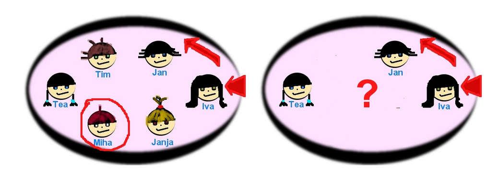

# Modularna aritmetika

Ura je 23:00. Ker skrbimo za zdrav spalni režim, da se lahko zjutraj spopademo z ogromno količino obveznosti, bomo spancu namenili točno osem ur. Ob kateri uri bomo nastavili budilko?

Odgovor je logičen, za osem ur spanja, bomo morali budilko nastaviti na sedmo uro zjutraj. Zakaj? Ena ura dneva še ostaja do polnoči, potrebujemo torej še sedem ur od polnoči naprej. 

Matematično gledano smo izračunali vsoto števil 23 in 8, nato pa, ker ima dan 24 ur, izračunali ostanek pri deljenju s 24:
$$
(23 + 8) \bmod 24 = 31 \bmod 24 = 7
$$
Z modularno aritmetiko se torej srečujemo vsak dan, a se tega pogosto niti ne zavedamo.

Modularna aritmetika oziroma računanje z ostanki pri deljenju je zelo pomembna tako v matematiki kot v računalništvu.
V računalništvu se v zadnjem času še posebej uporablja v kriptografiji, srečamo pa jo večinoma vedno kadar želimo delati s števili na določenem območju oziroma kadar imamo opravka s cikličnimi vzorci (ko pridemo do konca intervala, začnemo na začetku).

V programskih jezikih ostanek pri deljenju najpogosteje označujemo z znakom `%`. Tako bi na primer namesto $12 \bmod 10$ zapisali `12 % 10`.

## Brez računalnika

### Ura

Kot smo že ugotovili v uvodu, je intuitiven primer modularne aritmetike v vsakdanjem življenju ura. 

Denimo, da uporabljamo 12-urni zapis časa (ne zanima nas, če je dopoldne ali popoldne) in je trenutno točno polnoč. Ob kateri uri bo zvonil alarm, če odštevalnik časa nastavimo na:

* 10 ur? 
* 25 ur?
* 48 ur?
* 100 ur?

Kakšni bodo odgovori na zgornja vprašanja, če je trenutno ura 9:00?

### Izštevanka

Verjetno vsakdo pozna izštevanko "an ban pet podgan" ali kakšno podobno. 

Predstavljaj si, da v krogu stoji sedem udeležencev - za lažjo predstavi si lahko narišeš na list papirja. Bi znal napovedati (brez štetja) kdo bo prvi izpadel? Vsak udeleženec naj zapiše svojo napoved. Nato dejansko izvedite en krog izštevanke.

Dodatno vprašanje (izberi eno):
* Poskusite še z izštevanko John Marion iz Londona. Pri kom se bo izštevanka zaključila?
* Kdo bi izpadel, če bi imela izštevanka več zlogov/besed (npr. 30)? 

### Izštevanka II (težja)

Iva, Jan, Tim, Tea, Miha in Janja potrebujejo hrano za piknik. Ker nihče noče prostovoljno v trgovino, se dogovorijo, da naj izštevanka določi "srečnega izbranca". Izštevanko začnejo šteti pri Ivi v smeri proti Janu (glej spodnjo sliko). Izštevanka se ustavi pri Mihi. Točno tedaj zazvoni telefon. Miha, Tim in Janja morajo nujno takoj domov. Zdaj Iva, Jan in Tea ponovijo isto izštevanko. Spet začnejo pri Ivi in nadaljujejo proti Janu.

Kdo izmed preostalih treh otrok bo moral v trgovino?

_Vir: http://www.nauk.si/materials/1381/out/#state=3_

### Barvanje

Pred nami je polje dolžine 15 kvadratov. Kvadrate želimo barvati po vzorcu: prvo polje z modro, drugo z rdečo, tretje z rumeno, četrto z zeleno, peto spet z modro, šesto z rdečo, ...., kot prikazuje slika:

Sestavi ustrezen postopek. Če ti bo lažje, si pomagaj z ukazi, ki smo jih uporabljali na Pišku.

## Pišek
### [Soda števila](https://pisek.acm.si/contents/4907-1335524310189622543-111084607483962723-1674365692897792648-8239749173422368/)

Napiši program, ki izpiše vsa soda števila na vhodu.

Kako bi program priredili, da bi izpisoval liha števila?

_Opomba: V navodilih naloge na Pišku sicer piše, naj nalogo rešimo z uporabo tabele. Če tabel še ne poznaš, nalogo reši enostavno z branjem števil z vhoda, kot smo to že počeli pri prejšnjih temah. Ko spoznaš tabele, lahko rešitev za vajo razširiš še z uporabo tabele._

### [Hana hodi v šolo](https://pisek.acm.si/contents/4907-319805995281415931-481416162117402159-1958275130846188552/)

Hana se na poti v šolo dolgočasi, zato po poti barva kvadratke s kredo. Na začetku poti se odloči, koliko kvadratkov vmes bo preskočila. Pomagajmo ji pobarvati ustrezne kvadratke.

Če ti je bila naloga všeč, se lahko za vajo lotiš še nalog za ⭐⭐⭐ in ⭐⭐⭐⭐.

### Več nalog s Piška

* [Liha in negativna](https://pisek.acm.si/contents/4907-1335524310189622543-111084607483962723-1674365692897792648-180136988822293284/)
* [Ana deli](https://pisek.acm.si/contents/4907-1335524310189622543-111084607483962723-1618958160109896487-14671061452315435/) - Ker še ne poznamo funkcij, si to nalogo rahlo prilagodimo: izbriši predpripravljeno funkcijo in namesto tega enostavno nalogo reši z gradniki, ki jih poznaš.

## Za zagnane: Naprednejše naloge brez računalnika

Te naloge nekoliko presegajo obseg uvodnega tečaja, zato jih ne bomo reševali skupaj, razen če na koncu ostane čas in bo za to res velik interes. Če te zanima, jih lahko poskusiš rešiti samostojno, izvajalci tečaja pa ti bomo z veseljem pomagali, če se pojavi kakšno vprašanje.

### Fibonacci (2)

**Naloga:**

Želimo izračunati zadnjih nekaj (samo zadnjo) števk v velikem števlu, ki nas zanima.
Specifično, zanima nas zadnja števka v `fib(100)`.
Že prej so udeleženci spoznali fibonaccijevo zaporedje, ki je definirano, zato še enkrat izračunamo (lahko skupaj) 15. člen (`fib(0) = 0`, `fib(15) = 610`).

Spomnite se naloge s fibonaccijevim zaporedjem, kjer smo računali k-to zaporedno število.
Po izračunu `fib(15)` je očitno, da je `fib(100)` (~ $3.5 \times 10^{20}$) prevelik zalogaj, ampak, če nas zanima samo zadnja števka, lahko to izračunamo hitro. Spomni se, kako smo seštevali ure v prvi nalogi.

### Hitro potenciranje po modulu: 

Ugotovili smo, da lahko učinkovito izračunamo zadnjo števko pri številih, ki jih dobimo s seštevanjem, ali lahko to posplošimo?
Za množenje in potenciranje po modulu velja enako kot za seštevanje.

Naloga: hitro izračunaj ostanek $3^{20}$ (~ $3.4 * 10^9$) pri deljenju s 7.

Koliko operacij je bilo treba opraviti?

Naloga: Izračunaj še $3^4 \bmod 7$. (_Namig: Poskusi potenco razbiti na manjše stopnje, ki jih boš lažje izračunal_)

Koliko operacij je bilo treba opraviti sedaj?

Bi znali sedaj $3^{20}$ izračunati hitreje?

Razlaga: 

Če se spominmo pravila iz srednje šole, ki pravi da je $3^{20} = (3^4)^5$, potem lahko to izračunamo zelo hitro.

Kako to naredimo v praksi?

Opazili smo, da lahko zelo učinkovito kvadriramo stvari (ena operacija manj) in to samo posplošimo. Naravna posplošitev kvadriranja je potenciranje na potenco števila 2.
Eksponent zapišemo v dvojiškem zapisu in nato gledamo, kateri biti so enaki 1.
Tiste pomnožimo za končni rezultat, povsod drugje pa kvadriramo tisto s čimer množimo.

Oglej si razlago na [Khanacademy](https://www.khanacademy.org/computing/computer-science/cryptography/modarithmetic/a/fast-modular-exponentiation)