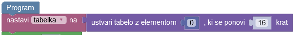

# Tabele

Ko gremo v trgovino, si napišemo nakupovalni listek, kamor po vrsti zapišemo vse stvari,
ki jih želimo kupiti, npr.

| 1     | 2      | 3   | ... | 10     |
| ----- | ------ | --- | --- | ------ |
| jajca | banane | riž | ... | zvezek |

V imeniku telefona imamo shranjen seznam vseh stikov, npr.

| 1           | 2           | 3           | ... | 10          |
| ----------- | ----------- | ----------- | --- | ----------- |
| Ana         | Bojan       | Cene        | ... | Žan         |
| 040 123 456 | 031 123 456 | 031 654 321 | ... | 040 987 654 |

Ko igramo Potapljanje ladjic, je igralno polje kvadratna tabela, npr.

|       | **A** | **B** | **C** | **D** | **E** |
| ----- | ----- | ----- | ----- | ----- | ----- |
| **1** |       |       |       |       | o     |
| **2** |       |       | o     |       |       |
| **3** | x     |       | o     |       |       |
| **4** | x     |       | o     |       |       |
| **5** |       |       |       |       | o     |

Ni presenetljivo, da so tudi v računalništvu tabele zelo prisotne. Uporabimo jih takrat, ko moramo shraniti več enakih podatkov, npr. števila, imena, itd.

Tabela je lahko enorazsežna (kot je nakupovalni seznam zgoraj), dvorazsežna (kot je tabela za potapljanje ladjic) ali večrazsežna. Njena odlika je, da lahko do vseh njenih elementov dostopamo
preko ustreznega indeksa. Tako lahko izvajamo ukaze, kot so

- ustvari tabelo dolžine $20$ in vse njene elemente nastavi na `krneki`
- iz dane tabele vrni element na mestu `3`
- v dani tabeli nastavi element na mestu `4` na `prtički`.

Nakupovalni seznam bi si npr. v programu lahko pripravili tako:

- ustvari tabelo dolžine $10$ in vse njene elemente nastavi na `??`
- v tabeli `nakup` nastavi element na mestu `1` na `jajca`
- v tabeli `nakup` nastavi element na mestu `2` na `banane`
- v tabeli `nakup` nastavi element na mestu `3` na `riž`
- ...
- v tabeli `nakup` nastavi element na mestu `10` na `zvezek`

Ko bi se v trgovini želeli spomniti, kaj je na mestu `3`, bi ukazali programu

- Vrni iz tabele `nakup` element na mestu `3`.

## Naloge na Portalu Pišek

### [Zmajček ustvarja tabele](https://pisek.acm.si/contents/4907-905475276192595697-447612994611913364-1887137937359333380/)

Pri tej nalogi moramo pobarvati označena polja, a senzorja, ki bi meril označenost nimamo!
V pomoč nam je prva vrstica, kjer so polja pobarvana (senzor za barvo imamo).

Ker ne moremo hoditi gor, nas program prisili, da si zapomnimo, kar smo videli v prvi vrstici,
zato si pripravimo tabelo (z imenom `tabelka`) dolžine 16 (toliko, kot je dolžina prve vrstice) in v njej vse elemente nastavimo na 0:

Če srečamo barvno polje, je treba tabelo posodobiti, npr. tako:

Vrednost 1 ni pomembna, važno je, da se razlikuje od 0.

Druga, sploh pa tretja stopnja naloge, sta kar težki.

**Opomba:** Če koščka `pobarvaj polje` ni, lahko uporabiš košček `izkoplji kovanček`.

### [Zmajček izpisuje tabele](https://pisek.acm.si/contents/4907-905475276192595697-447612994611913364-1496850131226426904/)

Preberimo števila, ki jih najdemo v vodoravni vrsti, in jih prepišemo v stolpec.
Kot prej si pripravimo tabelo, nato pa jo posodobimo, a pozor: število stolpca ni na voljo.

Lahko bi uporabili preprosto zanko (`ponavljaj 5 krat`), kot do sedaj:

a zato je treba definirati novo spremenljivko `korak`, saj moramo vedeti, kateri element tabele posodabljamo. Bolje je, da uporabimo zanko

ki že vsebuje ustrezno spremenljivko `i`, s pomočjo katere vemo, na katerem koraku smo.

### [Zmajček in skalarni produkt](https://pisek.acm.si/contents/4907-905475276192595697-447612994611913364-199781763712849731/)

Iz srednje šole že poznamo skalarni produkt dveh 2D ali 3D vektorjev:

- $(x_1, y_1)\cdot (x_2, y_2) = x_1 y_1 + x_2 y_2$, npr. $(3, 4)\cdot (1, 2) = 3\cdot 1 + 4\cdot 2 = 11$
- $(x_1, y_1, z_1)\cdot (x_2, y_2, z_2) = x_1 y_1 + x_2 y_2 + x_3 y_3$, npr. $(3, 4, 5)\cdot (1, 2, 3) = 3\cdot 1 + 4\cdot 2 + 5\cdot 3 = 26$

Vidimo, da sta predpisa zelo podobna in uganete lahko, kako se izračuna skalarni produkt 4D, 5D in drugih vektorjev, kar bo treba storiti pri tej nalogi.

### Dodatne naloge za vajo

- [Taborniška skupina Ogenj](https://pisek.acm.si/contents/4907-905475276192595697-336263441319752813-299337302389322177/): Preštej število tabornikov, katerih starost je enaka zahtevani.
- [Taborniška skupina Medved](https://pisek.acm.si/contents/4907-905475276192595697-336263441319752813-1635014616559399342/): Preštej število tabornikov, ki so starejši od predpisane meje.

## Brez računalnika

### Tribonaccijevo zaporedje in Pascalov trikotnik

1. Izračunaj prvih 9 členov **tri**bonaccijevega zaporedja. To zaporedje je podobno Fibonaccijevemu, saj se začne z 1, 1 in 2, vsak nasledji člen pa je vsota prejšnjih **treh**, tj. $t_{n + 3} = t_{n + 2} + t_{n + 1} + t_n$.
2. Izračunaj prvih 6 vrstic Pascalovega trikotnika. Spomnimo se: element Pascalovega trikotnika je vsota obeh elementov nad njim, če zgornja elementa oba obstajata, sicer pa 1. Premisli, kako trikotnik zložiti v (pravokotno) tabelo.